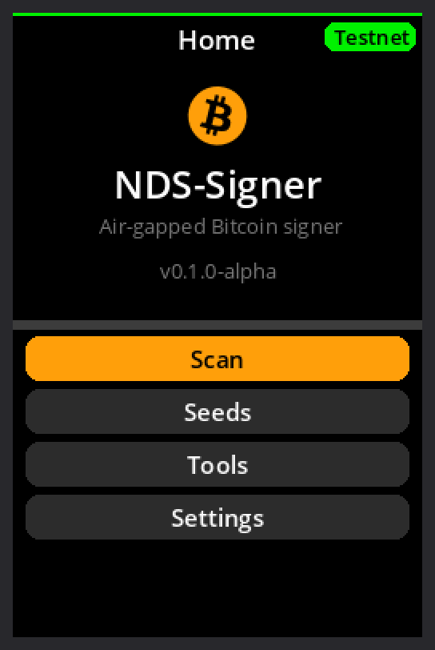
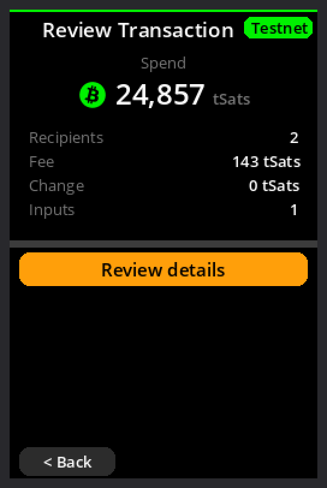
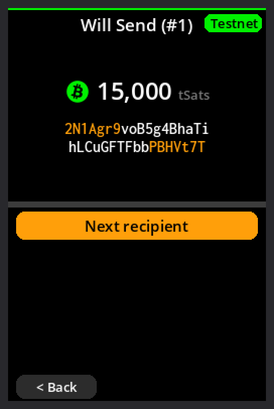
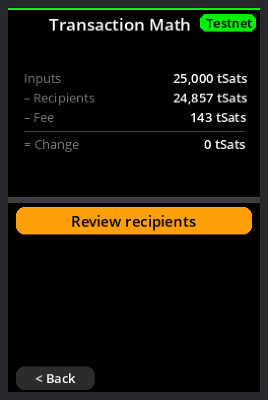
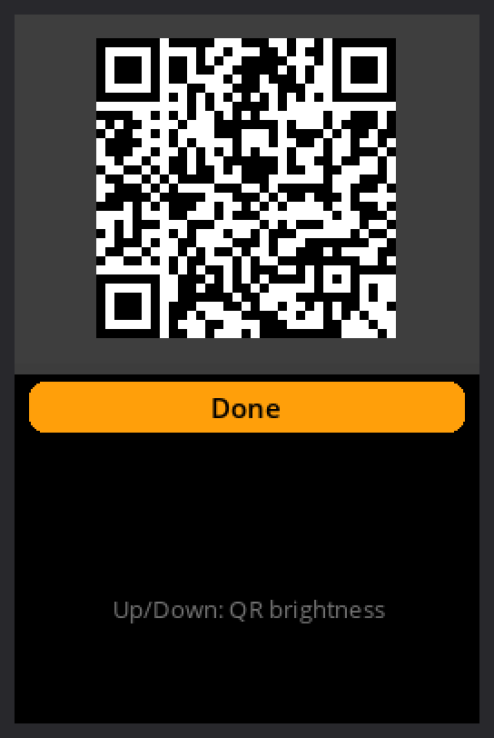
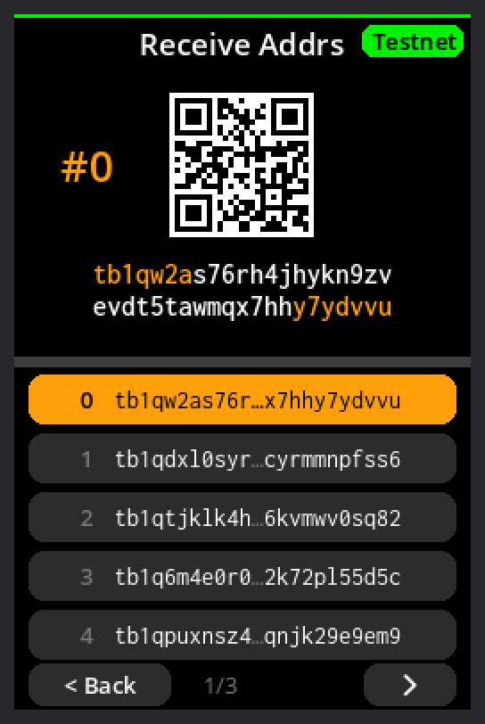
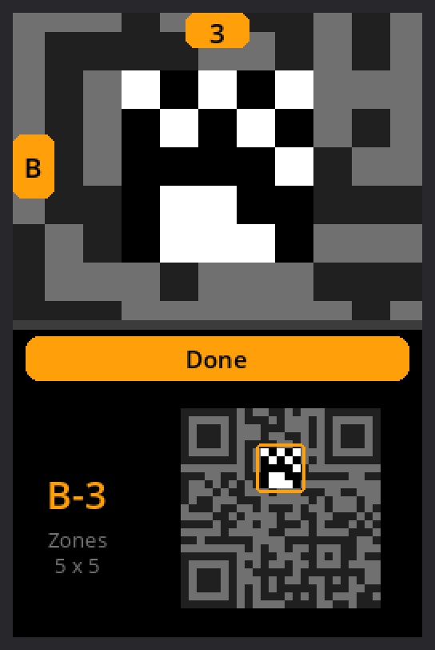
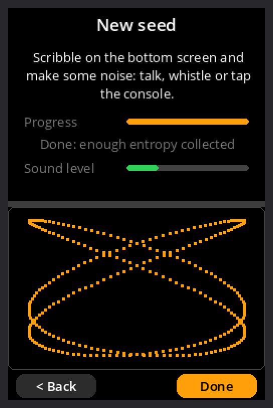
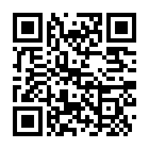

# NDS-Signer

**An air-gapped, stateless Bitcoin PSBT signer for the Nintendo DSi, running
[SeedSigner](https://github.com/SeedSigner/seedsigner)'s own code.**

*[Leer en español](docs/es/LEEME.md)*

> ⚠️ **Alpha software (v0.1.0-alpha).** It has not been audited. Try it on
> testnet/signet or with amounts you can afford to lose. Read the
> [disclaimer](#disclaimer).

A Nintendo DSi already has what a SeedSigner needs: a camera, two screens
(one of them touch), a battery and no network you have to trust. Second-hand,
it costs less than the parts of a DIY signer, and in a drawer it looks like
an old toy, not like a Bitcoin wallet. Why this project exists:
[docs/why.md](docs/why.md).

## Screenshots

Top and bottom screen of the DSi, rendered with the ROM's fonts by the
host simulator (`tools/dev/readme_screenshots.sh`):

<table>
<tr><td align="center"><br><sub>Home</sub></td><td align="center"><br><sub>Review the transaction</sub></td><td align="center"><br><sub>Each recipient's address</sub></td><td align="center"><br><sub>The amounts add up</sub></td></tr>
<tr><td align="center"><br><sub>Signed PSBT, animated QR</sub></td><td align="center"><br><sub>Address explorer with QR</sub></td><td align="center"><br><sub>SeedQR backup with a map</sub></td><td align="center"><br><sub>New seed: scribble + mic</sub></td></tr>
</table>

## What it does

NDS-Signer runs SeedSigner's Python code (views, PSBT verification, seed
handling, settings, translations) **unmodified** on the DSi, through
MicroPython, with embit and libsecp256k1 for the cryptography. Only the
screens and the hardware drivers are NDS-Signer's own: a dual-screen
touch interface, the DSi cameras, QR decoding and display.

- **Sign transactions:** scan a PSBT QR code (animated UR or static) from a
  watch-only wallet such as Sparrow, review recipients, change and fee on the
  top screen, approve, and show the signed PSBT as an animated QR code.
- **Seeds, only in RAM:** type the 12/24 words on the touch keyboard, scan a
  SeedQR (standard or compact), add a BIP-39 passphrase.
- **New seeds:** dice rolls, the camera (SeedSigner's image entropy), or
  NDS-Signer's own scribble + microphone tool; final word calculator.
- **Backups:** view the words, export a SeedQR to copy by hand (with a map
  of the whole code on the bottom screen), verify the backup.
- **Wallet setup and checks:** export the xpub as a QR code, address
  explorer (each address with its QR code), verify a receive address.
- **Settings:** network (mainnet, testnet/signet, regtest), units,
  16 languages (SeedSigner's translations; the console's language by
  default), feedback sounds, rear or front camera.

Tested on a real DSi XL: signing a Signet transaction created in Sparrow,
and exporting the xpub to Sparrow.

## Security model

- **No network.** The ARM7 (the DSi's second CPU, which owns the wireless
  chips) is built without the wireless driver, and powers both wireless chips
  and the wireless LED down at start.
- **Stateless.** Nothing is written to the SD card or the internal memory:
  the storage driver is not even linked. Seeds, passphrases and PSBTs live in
  RAM only.
- **Lid closed = wiped.** Closing the lid (or pressing the power button)
  overwrites the memory that may hold secrets and switches the console off.
  It never goes to sleep with a seed loaded.
- **No hardware RNG.** New seeds come only from what you provide: dice,
  camera images, scribbles and microphone noise.
- **Microphone and camera** are off except on the screens that use them.
- **Reproducible build.** The ROM is built in a pinned Docker image; anyone
  can rebuild it and compare its SHA-256 with the released file.

What it does **not** protect against: a compromised SD card or launcher
(they run before NDS-Signer), someone watching your screen, or a console
modified to record what it displays. Keep the SeedSigner advice: verify
addresses, and keep your seed words offline.

## Compatible wallets

NDS-Signer signs for a watch-only wallet ("coordinator") on your computer or
phone, exchanging QR codes, exactly like SeedSigner. Any wallet that works
with SeedSigner should work:

| Wallet | Computer | Phone | Tried with NDS-Signer |
| :--- | :---: | :---: | :---: |
| [Sparrow](https://sparrowwallet.com) | ✅ | | ✅ (xpub export, signing on Signet) |
| [Specter Desktop](https://specter.solutions) | ✅ | | |
| [Nunchuk](https://nunchuk.io) | ✅ | ✅ | |
| [Keeper](https://bitcoinkeeper.app) | | ✅ | |
| [BlueWallet](https://bluewallet.io) | | ✅ | |

Plus any wallet that reads and shows PSBTs as QR codes (animated UR or
static). Blank in the last column: expected to work, as with SeedSigner, but
not tried yet; reports welcome.

## Which consoles work

| Console | Works? |
| :--- | :---: |
| Nintendo DS, DS Lite | ❌ No (no camera, 4 MB RAM) |
| Nintendo DSi, DSi XL | ✅ Yes (tested on a DSi XL) |
| Nintendo 3DS / 2DS family | ❓ Untested |
| Emulators | ⚠️ Development only: never a real seed |

## Install

The console needs a homebrew launcher (Unlaunch, optionally TWiLight
Menu++). **[docs/install.md](docs/install.md)** explains it step by step:
preparing the DSi, checking the download, starting NDS-Signer and the first
test signature.

In short:

1. Download `nds-signer.nds` and `SHA256.txt` from the [releases](https://github.com/ndssigner/nds-signer/releases).
2. Check the file: `shasum -a 256 nds-signer.nds` must print the hash in
   `SHA256.txt`. Better still, [build it yourself](#build) and compare.
3. Copy `nds-signer.nds` to the SD card and launch it from Unlaunch (hold
   A + B while switching on) or TWiLight Menu++.

> **Official releases are published only here, on GitHub**, with their
> SHA-256, and the build is reproducible. A ROM from anywhere else, or an
> "update" announced anywhere else, is not NDS-Signer's.

## Known limitations

- **Alpha:** not audited by anyone outside the project.
- **Tested on real hardware:** single-signature native segwit wallets
  (`bc1q…`) with Sparrow, on Signet. Taproot and multisig come with
  SeedSigner's code but have not been tried on a DSi yet.
- **Scanning bright screens is slow:** lower the screen's brightness
  ([help wanted](docs/help-wanted.md)).
- **3DS family:** untested.

## Build

Needs Docker and git.

```bash
git clone --recurse-submodules https://github.com/ndssigner/nds-signer.git
cd nds-signer
docker build -t nds-signer-builder .
docker run --rm -v "$(pwd)":/source nds-signer-builder make MPY_APP=1
shasum -a 256 nds-signer.nds
```

The same commit gives the same SHA-256 on any machine.

### Tests

The host tests drive SeedSigner's controller and views through a simulator
of NDS-Signer's screens (every flow above, plus upstream's own test vectors),
on the same MicroPython and memory size as the ROM:

```bash
docker run --rm -v "$(pwd)":/source nds-signer-builder make mpy-unix
python3 -m venv build/venv && build/venv/bin/pip install -r tests/requirements.txt qrcode pillow
make -C tests/host all seedsigner PYTHON=$(pwd)/build/venv/bin/python
```

## Documentation

- [docs/install.md](docs/install.md): compatible consoles and installation.
- [docs/why.md](docs/why.md): why NDS-Signer exists.
- [docs/how-it-was-built.md](docs/how-it-was-built.md): how it was made
  (with AI), the decisions along the way, and how it was tested.
- [docs/architecture.md](docs/architecture.md): how SeedSigner's code runs
  on the DSi.
- [docs/help-wanted.md](docs/help-wanted.md): open problems.
- [docs/es/](docs/es/LEEME.md): the documentation in Spanish.
- [THIRD_PARTY.md](THIRD_PARTY.md): the projects NDS-Signer is built on.

## Contributing

Issues and pull requests are welcome, especially from people with a DSi to
test on. Please read [CONTRIBUTING.md](CONTRIBUTING.md) first; security
problems: see [SECURITY.md](SECURITY.md). NDS-Signer's
interface is its own, but its core is SeedSigner's: fixes to PSBT
verification, seeds or signing belong upstream, in SeedSigner or embit.

## Donate

NDS-Signer is free and has no funding. Donations help keep it going:

<table>
<tr><td align="center"><br><b>Bitcoin</b><br><code>bc1qx5snc0wlc8cg9gwxhyx27y6pkru8rnngyq7uja</code></td>
<td align="center"><br><b>Lightning</b><br><code>ndssigner@coinos.io</code><br><sub>LNURL (for wallets without Lightning addresses):<br><code>LNURL1DP68GURN8GHJ7CM0D9HX7UEWD9HJ7TNHV4KXCTTTDEHHWM30D3H82UNVWQHKUERNWD5KWMN9WGQ8XE42</code></sub></td></tr>
</table>

The same addresses are in the app (*Home → Donate*). NDS-Signer is built
on [SeedSigner](https://github.com/SeedSigner/seedsigner): please support it
too, at [seedsigner.com](https://seedsigner.com).

## Disclaimer

NDS-Signer is experimental software provided "as is", without warranty of
any kind (see [LICENSE](LICENSE), MIT). The authors take no responsibility
for its use or for any loss of funds. It is not affiliated with Nintendo or
with the SeedSigner project.
