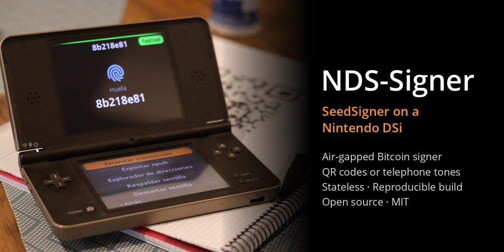
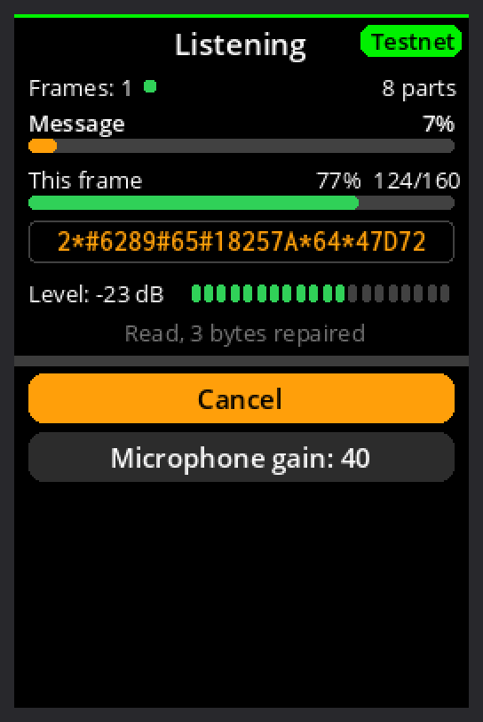
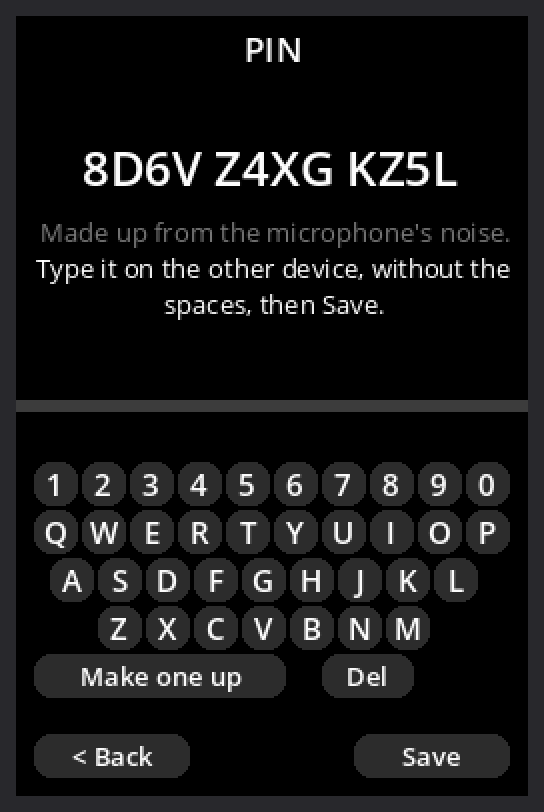
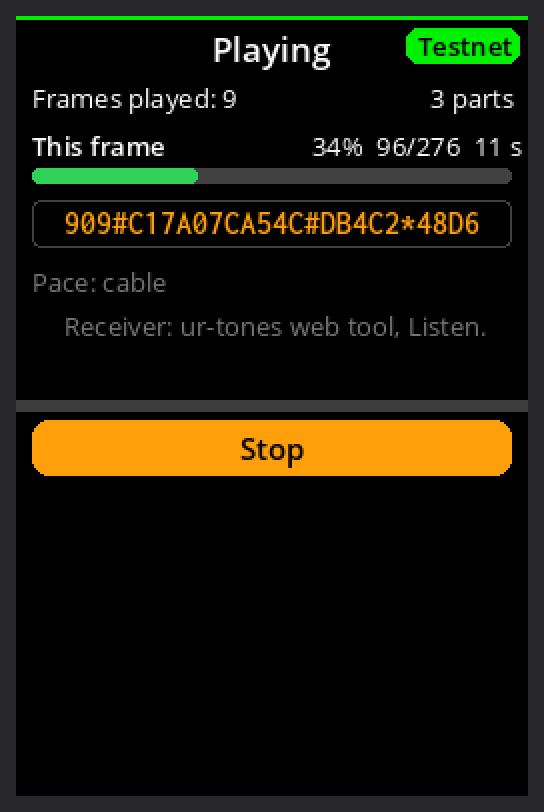
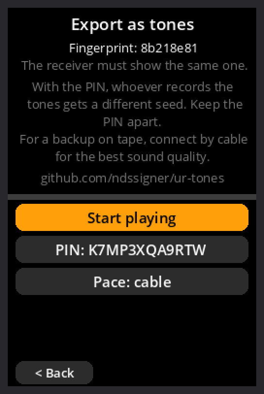

# NDS-Signer

**Un firmador de transacciones Bitcoin (PSBT) sin conexión y sin memoria
para la Nintendo DSi, que ejecuta el propio código de
[SeedSigner](https://github.com/SeedSigner/seedsigner).**

*[Read in English](../../README.md)*

> ⚠️ **Versión alfa (v0.2.0-alpha).** Nadie la ha auditado. Pruébala en
> testnet/signet o con cantidades que puedas permitirte perder.

Una Nintendo DSi ya tiene lo que necesita un SeedSigner: cámara, dos
pantallas (una táctil), batería y ninguna red de la que fiarse. De segunda
mano cuesta menos que las piezas de un firmador casero, y en un cajón parece
un juguete viejo, no una cartera de bitcoin. Por qué existe este proyecto:
[por-que.md](por-que.md).

## Capturas

Pantalla de arriba y de abajo de la DSi, dibujadas con las fuentes de la ROM
por el simulador de los tests (textos en inglés; en la consola salen en tu
idioma):

<table>
<tr><td align="center"> Inicio</td><td align="center"> Revisar la transacción</td><td align="center"> Dirección de cada destinatario</td><td align="center"> Las cuentas cuadran</td></tr>
<tr><td align="center"> Transacción firmada, QR animado</td><td align="center"> Direcciones con su QR</td><td align="center"> Copia del SeedQR con mapa</td><td align="center"> Nueva semilla: garabato + micro</td></tr>
<tr><td align="center"> Tonos: escuchando una PSBT</td><td align="center"> Tonos: un PIN inventado por la DSi</td><td align="center"> Tonos: enviando la PSBT firmada</td><td align="center"> Tonos: una semilla con su PIN</td></tr>
</table>

## Qué hace

- **Firmar transacciones:** escaneas el QR de una transacción preparada en
  una cartera de solo lectura (por ejemplo Sparrow), revisas destinatarios,
  cambio y comisión en la pantalla de arriba, apruebas y la DSi muestra la
  transacción firmada como QR animado.
- **Semillas, solo en memoria:** escribes las 12/24 palabras con el teclado
  táctil o escaneas un SeedQR; puedes añadir passphrase.
- **Semillas nuevas:** con dados, con la cámara o con garabato + micrófono.
- **Copias de seguridad:** ver las palabras, copiar el SeedQR a mano (con un
  mapa del código entero en la pantalla de abajo) y verificar la copia.
- **Cartera:** exportar la xpub como QR, explorador de direcciones (cada una
  con su QR) y verificar una dirección.
- **Ajustes:** red (mainnet, testnet/signet, regtest), unidades, 16 idiomas
  (el de la consola por defecto), sonidos, cámara trasera o frontal.

### Tonos de teléfono (experimental)

Además de con códigos QR, NDS-Signer puede intercambiar datos como **tonos
de teléfono (DTMF)**, por un cable de audio o al aire: el formato
[ur-tones](https://github.com/ndssigner/ur-tones). No hace falta cámara en
ningún lado, y viajan las mismas partes UR que en los QR animados, con
corrección de errores (dos tonos mal oídos por trama se reparan siempre) y
códigos fountain (una trama perdida cuesta una trama).

- **Recibir una PSBT:** en Sparrow, *Copy as Base64*; pégala en la
  [herramienta web de ur-tones](https://ndssigner.github.io/ur-tones/)
  (*Enviar*) y reprodúcela. En la DSi: *Escanear → Escuchar tonos
  (experimental) → Empezar a escuchar*; primero escucha y después pon en
  marcha el emisor. La pantalla superior muestra las tramas, el avance de
  la trama actual, los tonos según llegan y el nivel en dB; la inferior,
  Cancelar y la ganancia del micrófono.
- **Devolver la PSBT firmada:** *Enviar como tonos (experimental)*, junto a
  su QR animado; la herramienta web escucha (*Escuchar*) y da la PSBT para
  copiarla de vuelta en Sparrow.
- **Semillas, con PIN:** una semilla se puede recibir (*Escuchar tonos*) o
  exportar (*Respaldar semilla → Exportar como tonos*) a otro dispositivo o
  como copia en cinta o MP3 (por cable, que es como mejor suena). Con PIN,
  quien escuche o grabe los tonos obtiene otra cartera, vacía. Cualquiera de
  los dos lados puede inventar el PIN (la DSi, con el ruido de su
  micrófono: 12 caracteres, en grupos de cuatro) para que el otro lo
  escriba; los dos muestran la huella de la semilla, así que un PIN
  equivocado se nota al momento.

Al aire, cualquier micrófono de la habitación puede grabar lo que suena:
envía las semillas por cable, o con un PIN de 12 caracteres o más. El
receptor es la librería en C de ur-tones, solo con enteros
(`third_party/ur-tones/c`). Probado en una DSi XL: semillas al aire con y
sin PIN, y una PSBT de Sparrow al aire a ritmo de cable, en los dos
sentidos, en una habitación con ruido.

## Seguridad

- **Sin red:** el código del wifi ni siquiera está incluido, y los chips
  inalámbricos y su luz se apagan al arrancar.
- **Sin memoria:** nada se escribe en la SD ni en la memoria interna. Las
  semillas y las transacciones solo están en la RAM.
- **Cerrar la tapa lo borra todo:** al cerrarla (o pulsar el botón de
  encendido) se sobrescribe la memoria con secretos y la consola se apaga.
- **Sin azar del hardware:** las semillas nuevas salen solo de lo que tú
  pones (dados, imágenes, garabatos, ruido).
- **Compilación reproducible:** cualquiera puede compilar la ROM y comprobar
  que su huella SHA-256 coincide con la publicada.

## Carteras compatibles

NDS-Signer firma para una cartera de solo lectura ("coordinador") en tu
ordenador o tu móvil, intercambiando códigos QR, igual que SeedSigner.
Cualquier cartera que funcione con SeedSigner debería funcionar:

| Cartera | Ordenador | Móvil | Probada con NDS-Signer |
| :--- | :---: | :---: | :---: |
| [Sparrow](https://sparrowwallet.com) | ✅ | | ✅ (exportar xpub, firmar en Signet) |
| [Specter Desktop](https://specter.solutions) | ✅ | | |
| [Nunchuk](https://nunchuk.io) | ✅ | ✅ | |
| [Keeper](https://bitcoinkeeper.app) | | ✅ | |
| [BlueWallet](https://bluewallet.io) | | ✅ | |

Y cualquier cartera que lea y muestre transacciones PSBT como QR (animados UR
o estáticos). Sin cámara, cualquiera de ellas a través de la
[herramienta web de ur-tones](https://ndssigner.github.io/ur-tones/) y tonos
de teléfono (copiando y pegando la PSBT; experimental). En blanco en la última columna: deberían funcionar, como con
SeedSigner, pero aún no se han probado; se agradecen pruebas.

## Qué consolas sirven

| Consola | ¿Funciona? |
| :--- | :---: |
| Nintendo DS, DS Lite | ❌ No (sin cámara, 4 MB de memoria) |
| Nintendo DSi, DSi XL | ✅ Sí (probado en una DSi XL) |
| Familia Nintendo 3DS / 2DS | ❓ Sin probar |
| Emuladores | ⚠️ Solo desarrollo: nunca una semilla de verdad |

## Instalar

La consola necesita un lanzador de homebrew (Unlaunch y, si quieres,
TWiLight Menu++). **[instalar.md](instalar.md)** lo explica paso a paso:
preparar la DSi, comprobar la descarga, arrancar NDS-Signer y la primera
firma de prueba.

En resumen:

1. Descarga `nds-signer.nds` y `SHA256.txt` de las
   [versiones publicadas](https://github.com/ndssigner/nds-signer/releases).
2. Comprueba la huella: `shasum -a 256 nds-signer.nds` tiene que dar lo que
   pone en `SHA256.txt`.
3. Copia `nds-signer.nds` a la SD y ábrelo desde Unlaunch (mantén A + B al
   encender) o desde TWiLight Menu++.

> **Las versiones oficiales solo se publican aquí, en GitHub**, con su huella
> SHA-256, y la compilación es reproducible. Una ROM de cualquier otro sitio,
> o una "actualización" anunciada en otro sitio, no es de NDS-Signer.

## Limitaciones conocidas

- **Versión alfa:** nadie ajeno al proyecto la ha auditado.
- **Probado en la consola:** carteras de una firma Native Segwit (`bc1q…`)
  con Sparrow, en Signet. Taproot y multifirma vienen con el código de
  SeedSigner, pero aún no se han probado en una DSi.
- **Escanear pantallas muy brillantes es lento:** baja el brillo de la
  pantalla.
- **Familia 3DS:** sin probar.
- **Los tonos de teléfono son experimentales:** el formato ur-tones es un
  borrador y aún puede cambiar. En una habitación con ruido, o con el
  altavoz pequeño de la DSi lejos del receptor, usa el ritmo de aire, más
  lento.

## Guías

- [Instalar](instalar.md): consolas compatibles e instalación paso a paso.
- [Cómo se hizo](como-se-hizo.md) y [Desarrollo con el
  emulador](desarrollo-emulador.md).

## Donar

NDS-Signer es gratis y no tiene financiación. Los donativos ayudan a que
siga adelante:

<table>
<tr><td align="center"> <b>Bitcoin</b> <code>bc1qx5snc0wlc8cg9gwxhyx27y6pkru8rnngyq7uja</code></td>
<td align="center"> <b>Lightning</b> <code>ndssigner@coinos.io</code> LNURL (para carteras sin direcciones Lightning): <code>LNURL1DP68GURN8GHJ7CM0D9HX7UEWD9HJ7TNHV4KXCTTTDEHHWM30D3H82UNVWQHKUERNWD5KWMN9WGQ8XE42</code></td></tr>
</table>

Las mismas direcciones están en la aplicación (*menú principal → Donar*).
NDS-Signer está hecho sobre [SeedSigner](https://github.com/SeedSigner/seedsigner):
apóyalo también en [seedsigner.com](https://seedsigner.com).

## Aviso

NDS-Signer es software experimental, sin garantía de ningún tipo (licencia
MIT). Los autores no se hacen responsables de su uso ni de pérdidas de
fondos. No tiene relación con Nintendo ni con el proyecto SeedSigner.
